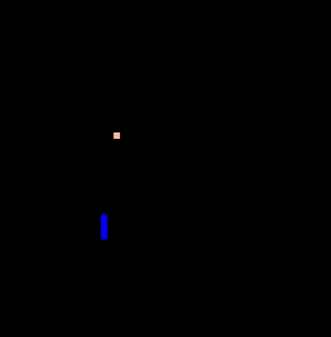
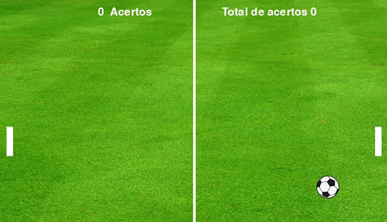

# Jogos Criados em Python

Decidi criar este repositório para compartilhar os meus primeiros projetos utilizando a linguagem Python. Esses jogos foram criados em 2020, não me recordo qual versão do Pygame e do Python utilizei na época, no inicio não tinha essa noção de documentar meus projetos, mas eu testei a versão 2.1.2 do Pygame e a versão 3.10.9 do Python e funcionou.

A minha principal motivação para criar estes jogos, foi botar em pratica o que eu havia aprendido em Python.

Coloquei em ordem de criação, onde eu comecei do jogo que eu considerava o mais fácil até o mais difícil.

## Snake

## Uma replica personalizada do Pong

## Asteroide

É um jogo de nave onde o objetivo, é destruir os asteróides antes deles atingirem a Terra ou baterem na nave.

## Projeto Plataforma

Este eu não finalizei, falta eu criar os adversários do personagem e aumentar o game map. Mas ele tem como objetivo se parecer um pouco com o jogo do Super Mario.

